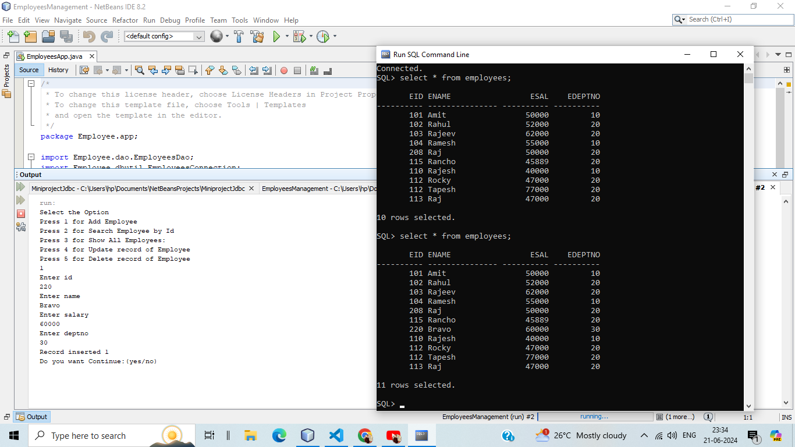
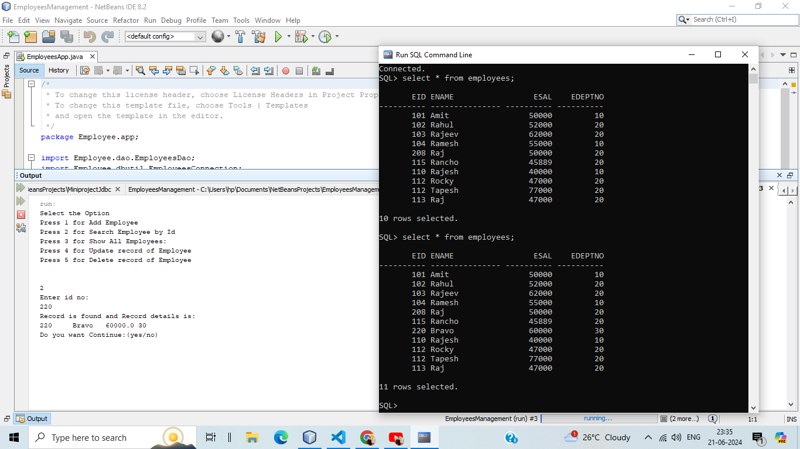
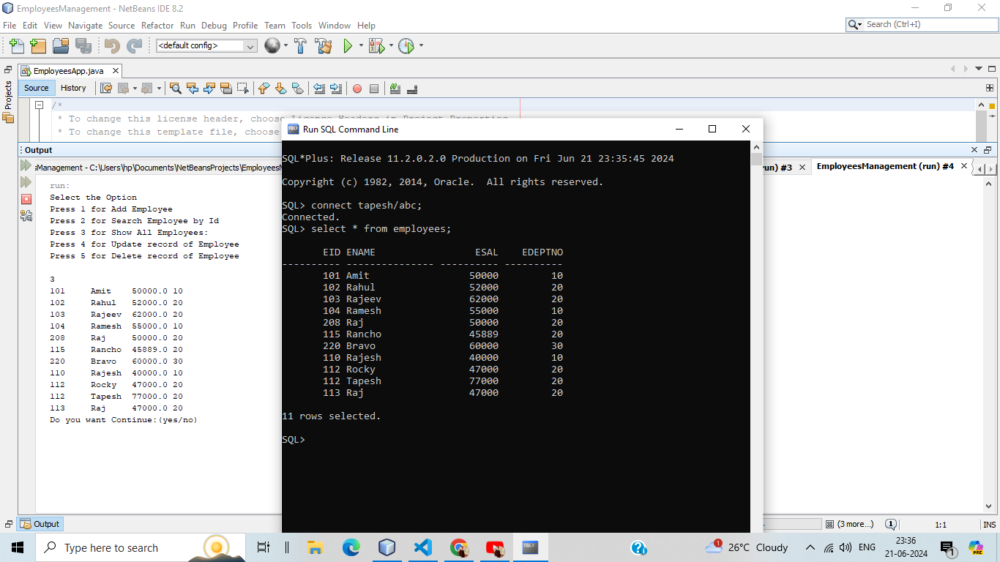
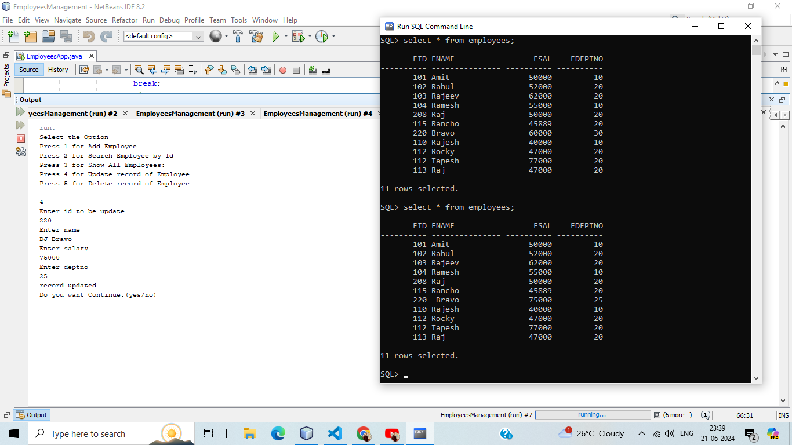
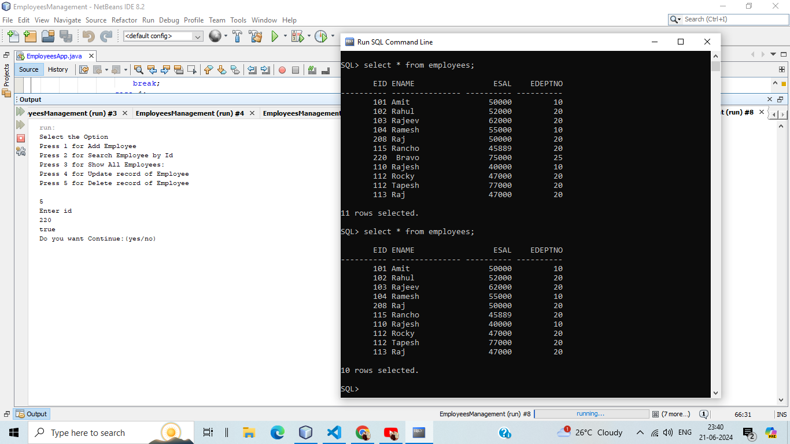

# Employee Management Project

<h2>Overview </h2>
The Employee Management Project is a Java-based application designed to manage employee records efficiently. The project leverages Java's JDBC (Java Database Connectivity) to interact with a relational database, providing functionalities to perform CRUD (Create, Read, Update, Delete) operations on employee data. This application is ideal for organizations looking to maintain a streamlined process for managing their workforce.

# Features

 <pre>
Add Employee: Add new employee records to the database.
View Employees: Retrieve and display a list of all employees.
Update Employee: Modify existing employee details.
Delete Employee: Remove employee records from the database.
Search Employee: Search for employees based on specific criteria.
</pre>

# Technologies Used

<pre>
Java: The primary programming language used for developing the application.
JDBC: Java Database Connectivity for database interactions.
Oracle database: The relational database management system used to store employee data.
Netbeans: Integrated Development Environment (IDE) for coding and debugging.
</pre>

# Prerequisites

Java Development Kit (JDK) 8 or higher: Ensure Java is installed and configured. 
Oracle Server: The database server to store and manage employee data. 
JDBC Driver Oracle: <strong>Type 4 driver</strong> for enable Java applications to communicate with the SQL database. 

# Setup and Installation

<h2>Clone the repository:</h2> 

Copy code  
git clone https://github.com/tapeshchavle/Employees-Management.git 
cd EmployeeManagement 

<h2>Configure the database:</h2> 

<strong>Install Oracle and create a table named employees</strong> 

# Add Employees:

Select the "Add Employees" option to add a new employees in database.
</img>

# Searching for an Employee:

Select the "Search Employee" option and provide the search criteria.
</img>

# Show Employees:

Select the "Show Employees" option to see a list of all employees.
</img>

# Updating an Employee:

Select the "Update Employee" option, provide the employee ID, and the new details to update.
</img>

# Deleting an Employee:

Select the "Delete Employee" option and provide the employee ID to remove the record.
</img>

# Project Structure

EmployeesApp.java: The main class to run the application. 
DatabaseConnection.java: Manages the database connection. 
EmployeesDAO.java: Data Access Object for employee operations for database. 
EmployeesPojo.java: Convert the user input into the object. 

# Contribution

Contributions are welcome! Please fork the repository and submit a pull request with your changes. 
<strong>tapeshchawle@gmail.com</strong>
